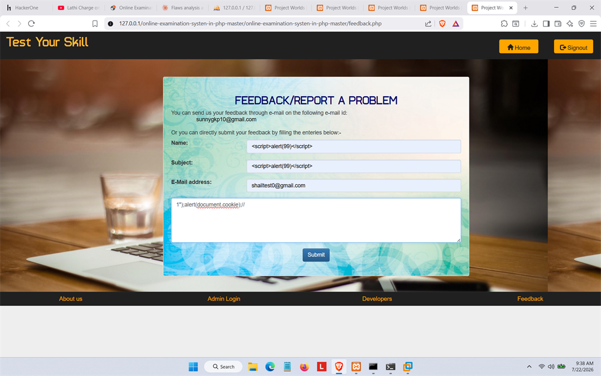
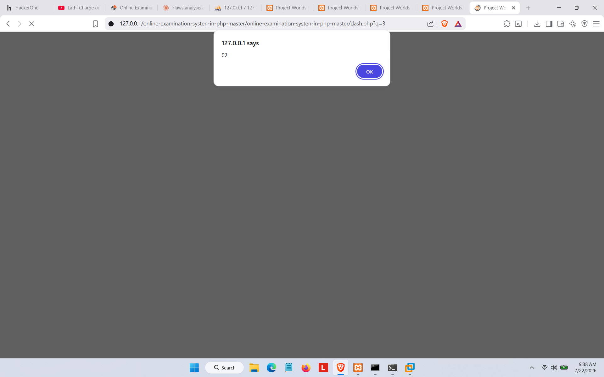

# ProjectWorlds Online Examination System - Stored XSS in feedback.php

## Summary
A stored Cross-Site Scripting (XSS) vulnerability exists in `feedback.php` of the
**Online Examination System Project in Php Mysql** by ProjectWorlds. The `Name`
and `Subject` fields are not sanitized before being stored and later rendered on
the admin dashboard, resulting in JavaScript execution in the administrator's
authenticated session.

- **Vendor:** ProjectWorlds
- **Product:** Online Examination System Project in Php Mysql
- **Affected Version:** 1.0 (master branch)
- **Entry:** VDB-399395
- **CVE id:** CVE-2026-86238
- **Vendor Homepage:** https://projectworlds.com/free-projects/php-projects/online-examination/
- **Vulnerability Type:** Stored XSS — CWE-79 
- **Affected File:** `feedback.php` (input), `dash.php?q=3` (execution/sink)
- **Affected Parameters:** `Name`, `Subject`

## CVSS 3.1
`AV:N/AC:L/PR:N/UI:R/S:C/C:L/I:L/A:N`

## Steps to Reproduce
1. Navigate to `feedback.php` on a running instance.
2. Fill the form:
   - Name: ``
   - Subject: ``
   - Email: any valid-format address
   - Message: any value
3. Submit the form — the payload is stored without sanitization.
4. Log in as admin and open the dashboard's Feedback tab (`dash.php?q=3`).
5. The payload executes immediately, confirmed by an `alert(99)` popup.

## Proof of Concept

**1. Payload stored via feedback.php**

**2. Payload executes on admin dashboard**

## Impact
Executes arbitrary JavaScript in the admin's session context — enabling
session/cookie theft, CSRF token exfiltration, or full admin account takeover.

## Remediation
Apply output encoding (`htmlspecialchars()` or equivalent) to all feedback
fields at both storage and render time in the admin dashboard.

## Disclosure Timeline
- Discovered: 2026-07-22
- Reported: TBD

## Credit
Reported by Shailendra Mourya (CyberShailendra) 
